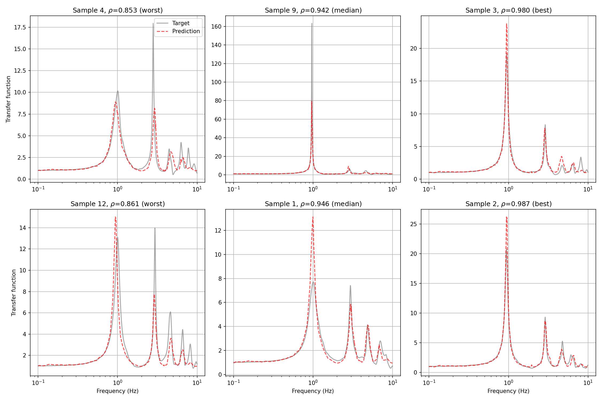

# Surrogate Modeling of Seismic Waves

[](https://github.com/KurtSoncco/surrogate-seismic-waves)
[](https://www.python.org/)
[](https://github.com/KurtSoncco/surrogate-seismic-waves)
[](https://github.com/astral-sh/uv)
[](https://opensource.org/licenses/MIT)
[](https://github.com/KurtSoncco/surrogate-seismic-waves/stargazers)

> This repository develops surrogate models for seismic wave propagation and site-response prediction. We benchmark operator-learning approaches (Fourier Neural Operators, DeepONets), latent-space pipelines, and autoencoder-based representations against physics-based simulations from **ITASCA FLAC** (1D layered profiles) and **OpenSees** (2D soil-variability domains). The goal is accurate transfer-function prediction with orders-of-magnitude faster inference than full physics runs.

[Research Questions](#-research-questions--hypothesis) • [Repository Layout](#-repository-layout) • [Methodology](#️-methodology) • [Data](#-data) • [Experiments](#-experiments) • [Key Results](#-key-results) • [How to Reproduce](#-how-to-reproduce)

---

## 🎯 Research Questions / Hypothesis

- How effective are operator-learning models (FNO, DeepONet) versus classical 1D/2D physics simulators for predicting transfer functions?
- Can latent-space or autoencoder front-ends improve FNO training on high-dimensional soil profiles?
- Does spectral boosting (multi-stage residual FNO) reduce error beyond a single well-trained base model?
- What is the accuracy vs. speed trade-off when generalizing to unseen soil profiles and frequency content?

---

## 📁 Repository Layout

```
surrogate-seismic-waves/
├── wave_surrogate/          # Core library: FNO, DAE, PCE, FLAC API, TTF utilities
├── experiments/             # Research experiments (see below)
│   ├── GIFNO/               # Shared data loader, losses, Delta scripts
│   ├── GIFNO-FDO-XT-LOGLO-POD/  # Active: LOGLO encoder + POD readout (best 2D model)
│   ├── latent_FNO/          # Encoder → latent FNO → decoder pipeline
│   ├── rf_seed/             # 2D Vs → transfer function FNO baseline
│   ├── Multi-Input Operator/# DeepONet (branch + trunk)
│   ├── SpecBoost/           # Two-stage spectral boosting (negative result)
│   └── dae/                 # Denoising autoencoders & OT encoders (experimental)
├── tests/                   # CI test suite (library + selected experiment tests)
└── pyproject.toml           # uv project config, Ruff, pytest
```

---

## 🛠️ Methodology

1. **Data generation**
   - **1D FLAC profiles:** Layered Vs/Vp/ρ profiles → transfer functions (pickle/parquet datasets).
   - **2D OpenSees runs (GIFNO):** H5 wavefield snapshots on a 500 m soil-variability strip with lateral recorders; transfer functions computed in preprocessing.

2. **Surrogate modeling**
   - **Direct FNO / DeepONet:** Map soil inputs to frequency-domain transfer functions.
   - **Latent FNO:** Compress inputs with an encoder, apply FNO in latent space, decode to TF.
   - **DAE / OT encoders:** Learn compact representations of Vs or multi-channel soil profiles before operator learning.
   - **Composite losses (GIFNO):** Masked relative Lp + optional H¹ frequency loss + hard-example mining at recorder locations.

3. **Evaluation**
   - Regression: MSE, MAE, RMSE, R², relative L2.
   - Shape fidelity: per-sample and per-frequency Pearson correlation, H¹ frequency metrics.
   - Diagnostics: worst/median/best sample plots, spatial TF heatmaps, W&B logging.

---

## 💾 Data

Datasets are **not stored in this repository** due to size.

| Source | Description | Used by |
|--------|-------------|---------|
| FLAC 1D profiles | Vs profiles + transfer functions (~1000 samples) | `wave_surrogate`, `latent_FNO`, `Multi-Input Operator`, `rf_seed` |
| OpenSees H5 (Box / HPC) | 2D wavefield runs (`run_*.h5`) + derived TF cache | `GIFNO`, `GIFNO-FDO-XT-LOGLO-POD` |
| Local dummy data | Synthetic paths for unit tests (no Box mount) | `GIFNO/tests` |

**Local data access (GIFNO):** mount Box at `/mnt/box_lab` or set:

```bash
export GIFNO_DATA_ROOT="/path/to/data"   # must contain h5/ and transfer_function/
```

On HPC (NCSA Delta, Savio), use the shell scripts in `experiments/GIFNO/` (`delta_run_all.sh`, `savio_train.sh`, `lambda_train.sh`).

---

## 🧪 Experiments

### `GIFNO-FDO-XT-LOGLO-POD` — LOGLO encoder + POD readout (active)

Best 2D OpenSees surrogate: **dual-path LOGLO spectral encoder** (depth-collapsed to 1D-along-x) + **POD-DeepONet readout**. Publication model: `tier2_pod64` (W&B `sweep_tier2_pod64_n2000`, full run `sweep_tier2_pod64_full`).

- **Input:** `(4, 128, 500)` — normalized Vs, zeta, x/z coords on the 500 m variability strip.
- **Output:** Transfer functions at 21 lateral recorders × 1000 frequencies.
- **Training:** Convergence band curriculum + composite loss (radial, H¹, band-balanced); W&B project `gifno_fdo_xt_loglo_pod`.
- **OOD checks:** `capability_check.py` vs seiskit `three_layer/` and `dipping/` experiments.

```bash
cd experiments/GIFNO-FDO-XT-LOGLO-POD
source ../GIFNO/delta_env.sh
uv run python capability_check.py --all          # OOD capability checks
sbatch --time=24:00:00 delta_train.sh            # full-dataset training
```

Shared infrastructure (data loader, metrics, Delta scripts) lives in `experiments/GIFNO/`.

### `GIFNO` — shared OpenSees pipeline (legacy baseline)

Original grid-direct FNO baseline and **shared library** for LOGLO-POD: H5 data loading, TF preprocessing, metrics, and NCSA Delta deployment scripts.

```bash
cd experiments/GIFNO
uv run python main.py --limit 32    # legacy baseline smoke test
```

### `latent_FNO` — Latent-Space FNO

Tests whether FNO is more effective in a learned latent space:

`Vs profile → Encoder → FNO processor → Decoder → Transfer function`

Modular encoders (MLP, CNN, Transformer), FNO processors (simple, sequence, multiscale, adaptive), and decoders. Supports ablation studies and W&B tracking.

```bash
cd experiments/latent_FNO
uv run python main.py list-configs
uv run python main.py train --config baseline --epochs 1000
uv run python main.py ablation
```

### `rf_seed` — 2D Vs → TF FNO Baseline

2D CNN encoder on `(67 × 1500)` Vs grids + FNO operator decoder → 1000-point transfer function. Useful seed/baseline for spatially extended profiles.

```bash
cd experiments/rf_seed
uv run python main.py
```

### `Multi-Input Operator` — DeepONet

Branch network (Vs profile) + trunk network (frequency coordinates) following the DeepONet formulation for operator learning on 1D profiles.

### `SpecBoost` — Spectral Boosting (negative result)

Two-stage training inspired by [FNO spectral analysis (arXiv:2404.07200)](https://arxiv.org/abs/2404.07200): a base FNO followed by a residual-correction FNO. **Conclusion:** residuals after the first model were too small and poorly structured for the booster to learn; multi-stage boosting did not improve accuracy.

### `dae/` — Autoencoders & OT Encoders (experimental)

- **`Vs_profiles/`:** Decoupled autoencoder for 1D Vs reconstruction; OT encoder/decoder variants.
- **`FNO_latent/`:** OT encoder + 1D FNO surrogate on soil profiles (research prototype).
- **`TF/`:** Transfer-function autoencoder experiments.

These scripts are excluded from CI pytest (`--ignore=experiments/dae`); use them interactively when data paths are configured.

### `wave_surrogate` — Core Package

Reusable implementations tested in CI:

- `models/fno/` — 1D FNO training pipeline
- `models/dae/` — Denoising autoencoder architectures
- `models/pce/` — Polynomial chaos expansions (JAX)
- `flac/` — FLAC API helpers
- `ttf/` — Transfer-function utilities (Kohmachi, acceleration → FAS)

---

## 📊 Key Results

### Latent FNO — best configuration (saved run)

On the 1D FLAC hold-out test set (150 samples, 1000 frequency points):

| Metric | Value |
|--------|-------|
| R² | **0.787** |
| Pearson (overall) | **0.890** |
| Mean sample correlation | **0.901** |
| Min sample correlation | **0.766** |
| RMSE | 2.10 |
| MAPE | 14.7% |

Latent FNO clearly outperformed simpler baselines in the same ablation sweep (e.g. test R² ≈ 0.30 for several MLP/CNN-only configs). Operating FNO in a learned latent space improved both amplitude and spectral shape fidelity.

### SpecBoost — spectral boosting

Multi-stage residual FNO did **not** improve predictions; residual magnitudes were ~1 order of magnitude too small and weakly correlated with inputs. A single well-tuned FNO (or latent FNO) is preferred over boosting for this dataset.

### LOGLO-POD — 2D OpenSees operator (best model)

On the 2000-sample screen hold-out (`tier2_pod64`, convergence band curriculum):

| Metric | Value |
|--------|-------|
| `test_rel_l2` | **0.302** |
| `test_pearson` | **0.919** |
| `test_pearson_mean` (per-recorder) | **0.939** |

**OOD capability checks** (3-layer profiles, dipping interfaces) fail catastrophically
(rel L2 ~16–26, Pearson ≈ 0) — see `experiments/GIFNO-FDO-XT-LOGLO-POD/capability_check.py`
and docs under `checkpoints/capability_checks/` (local, gitignored).

Full-dataset training (`sweep_tier2_pod64_full`) is the publication target on Delta.

### rf_seed — 2D Vs baseline

Example evaluation plots are saved under `experiments/rf_seed/results/` (`predictions_summary.png`, `correlation_vs_frequency.png`, etc.).



---

## 🚀 How to Reproduce

### 1. Clone and set up the environment

```bash
git clone https://github.com/KurtSoncco/surrogate-seismic-waves
cd surrogate-seismic-waves

pyenv local 3.11   # optional
uv venv
source .venv/bin/activate
uv sync --extra dev   # installs ruff, pytest, and all dependencies
```

### 2. Run CI checks locally (recommended before push)

```bash
uv run ruff check .
uv run pytest
```

CI runs the same steps on every push to `main` ([workflow](.github/workflows/ci.yml)).

### 3. Run an experiment

Point data paths via each experiment's `config.py` or environment variables, then:

```bash
# Example: latent FNO training
cd experiments/latent_FNO && uv run python main.py train --config baseline

# Example: LOGLO-POD capability check or training
cd experiments/GIFNO-FDO-XT-LOGLO-POD && uv run python capability_check.py --all
```

### 4. GIFNO on NCSA Delta (from WSL)

```bash
bash experiments/GIFNO/delta_run_all.sh
```

Requires Box mount (`go-lab`), Duo MFA for SSH, and W&B credentials on the cluster.

---

## 🔧 Development Notes

- **Package manager:** [uv](https://github.com/astral-sh/uv) with lockfile (`uv.lock`).
- **Linting:** Ruff (`uv run ruff check .`).
- **Tests:** pytest over `wave_surrogate`, `GIFNO`, and `GIFNO-FDO-XT-LOGLO-POD`; `experiments/dae` excluded.
- **Logging:** Weights & Biases for experiment tracking where configured.

---

## 📄 License

MIT — see [LICENSE](LICENSE).
