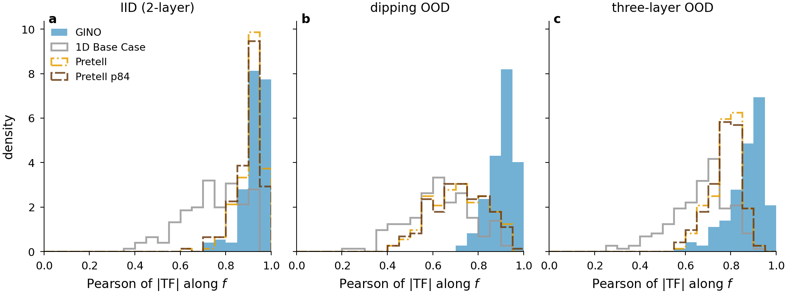
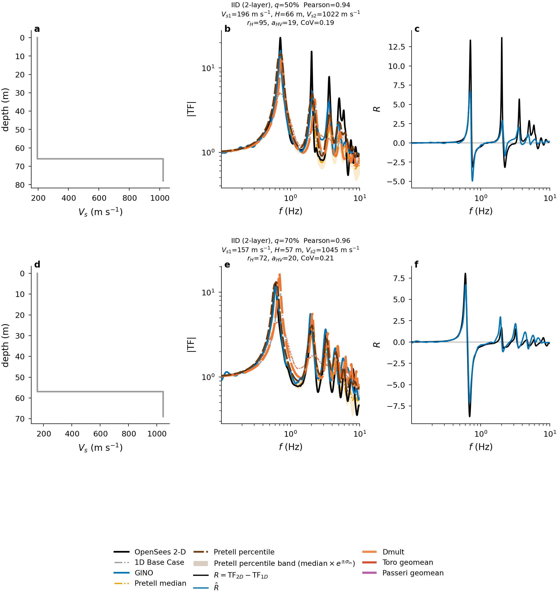
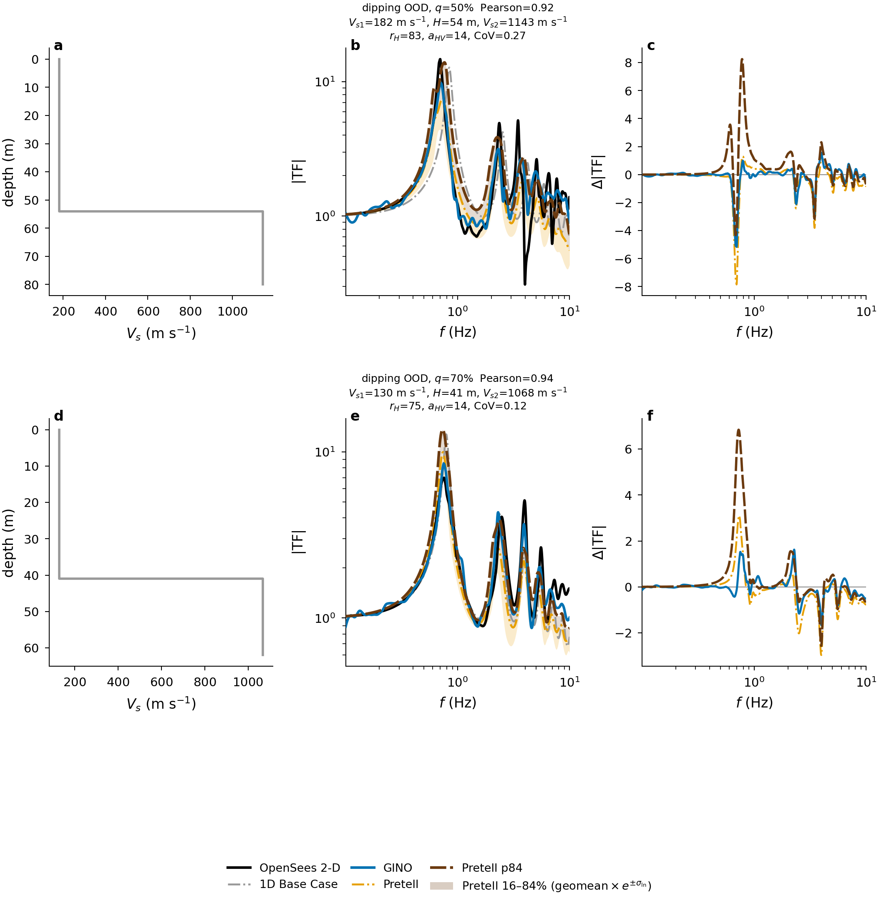
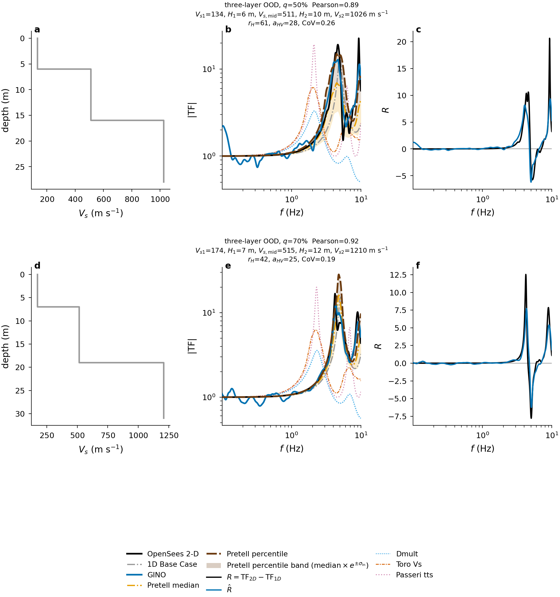
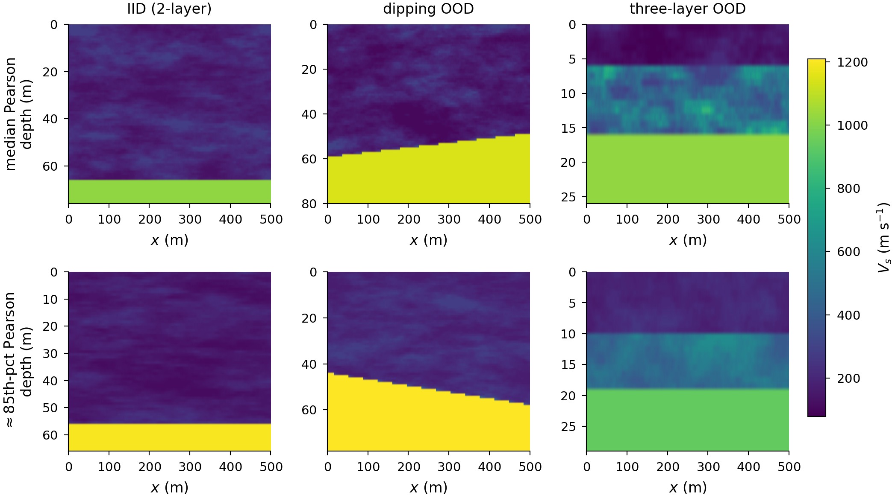
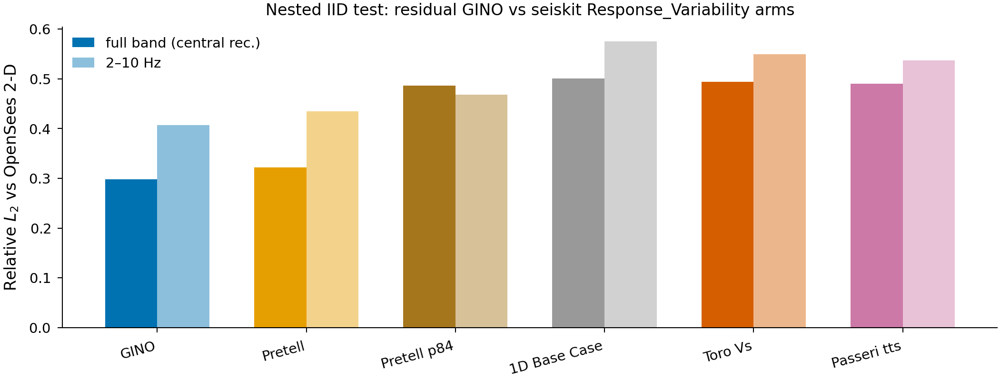
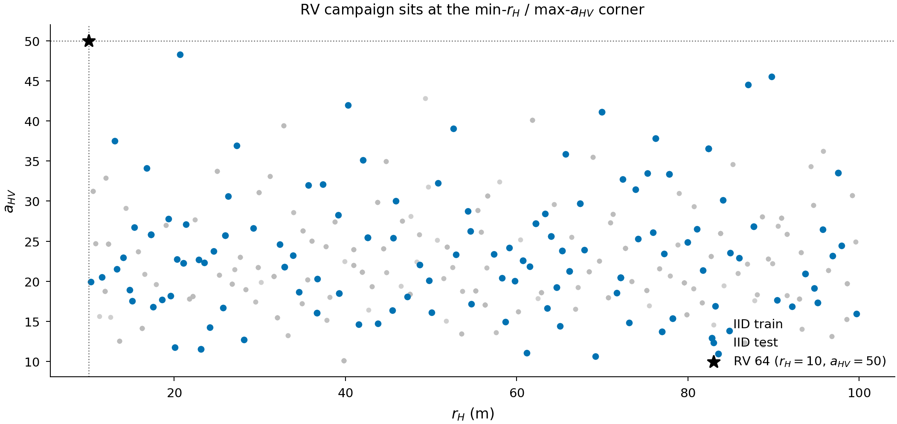
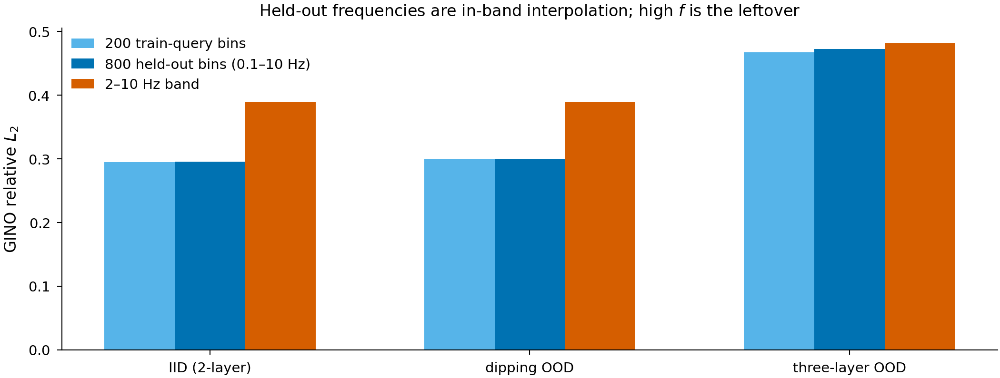

# DeepONet-Residual

Signed residual DeepONet: **single shared branch** encodes material fields
`(Vs, ζ, Z=ρ·Vs)` plus stochastic context `(ξ_re/im, r_H, aHV, CoV, ξ_damp)`,
trunk queries mesh-agnostic `(x/λ, f*, sin, cos)` and (shipped) `log TF_1D`,
output signed `R = TF_2D − TF_1D` for geometry-aware **R_nom**.

**Shipped leftover is a 21-node chain GNN**, not Li et al.’s kernel-integral
GNO. Mesh-agnostic queries apply to **frequency** (and the scalar \(x/\lambda\));
the branch codes \(p\) exist only at the trained recorder indices (15 m spacing
on the cropped strip). `--encoder kernel` is the distance-kNN query GNO
(Savio spatial-query arms). Those arms **KILL** the nested three-layer gate
(16 Sep 2026); interpolate neighboring ship \(p\) remains the spatial query
between stations. See [`results/SPATIAL_QUERY.md`](results/SPATIAL_QUERY.md).
Do not replace `M7680_gino_rebal_ft.pt` until a kernel arm wins the nested
21-station gates **and** station hold-out vs interpolate-\(p\).

**Shipped recipe:** freeze-GNO fine-tune of mix **M7680**
(`iid_frac=0.34`, three-layer val stop, vanilla FNO-on-\(R\)). Checkpoint:
`checkpoints/M7680_gino_rebal_ft.pt`.

Architecture choice follows Park et al. (Commun Eng 2026 / arXiv:2507.03660):
single-branch preferred for tightly coupled multiphysics; multi-branch kept as ablation.

Feature screening (MI/RF gate) is archived; physics features live in `features.py`.

## Training

- Loss: `SmoothL1Loss` only (`beta=1.0` in config); optional aux TF rel L2 in `arch_train.py`
- Optimizer: `AdamW` with `betas=(0.9, 0.999)`, `weight_decay=1e-5`
- Train on `--n-freq-train` log-spaced queries (default **200**); **always eval at 1000 bins**
- Defaults: `--target R_nom --field-encoder resunet --serial-tf1d`
- Progress: wandb + tqdm (offline if no `WANDB_API_KEY`; online on Lambda via `lambda_secrets.env`). §10–12 archive is `deeponet-residual`; n-scale Lambda runs go to `deeponet-nscale` (`lambda_train.sh` default).

## Quick start

```bash
# Domain-mix study (splits, operator bake-off, P0–P4, arch). Caches reused if present.
GIFNO_DATA_ROOT=data/gifno_screen \
GIFNO_OOD_DIPPING=data/gifno_screen/ood_dipping \
GIFNO_OOD_THREE_LAYER=data/gifno_screen/ood_three_layer \
uv run python experiments/DeepONet-Residual/domain_study.py --skip-cache

# Score shipped residual on Box OOD (default checkpoint = rebal GINO)
uv run python experiments/DeepONet-Residual/eval_ood.py --split test

# n-ladder / FNO / GNO bake-off
uv run python experiments/DeepONet-Residual/arch_train.py --mix M700 --encoder gno --fno

# Haskell floor only
uv run python experiments/DeepONet-Residual/eval_ood.py --haskell-only
```

IID-only scale ladder (not the shipped mix):

```bash
uv run python experiments/DeepONet-Residual/residual_signed.py --cache-tag n2000_seed42
uv run python experiments/DeepONet-Residual/run_scale.py \
  --cache-tag n2000_seed42 --encoder resunet --n-freq-train 200
```

Stage a laptop/cloud pack (TF cache + stratified H5 + OOD):

```bash
experiments/DeepONet-Residual/stage_screen_pack.sh /path/to/gifno_screen
export GIFNO_DATA_ROOT=/path/to/gifno_screen
```

## Lambda (GINO-wide + wandb online)

Start a `gpu_1x_a10` (or A100). From the laptop:

```bash
HOST=ubuntu@<LAMBDA_IP>
rsync -az --exclude .venv --exclude wandb --exclude '*.pt' \
  ~/surrogate-seismic-waves/ "$HOST:~/surrogate-seismic-waves/"
rsync -az ~/surrogate-seismic-waves/data/gifno_screen/ \
  "$HOST:~/surrogate-seismic-waves/data/gifno_screen/"
rsync -az ~/surrogate-seismic-waves/experiments/DeepONet-Residual/cache/ \
  "$HOST:~/surrogate-seismic-waves/experiments/DeepONet-Residual/cache/"
scp experiments/GIFNO/lambda_secrets.env \
  "$HOST:~/surrogate-seismic-waves/experiments/GIFNO/"
```

On the instance:

```bash
tmux new-session -d -s gino \
  "cd ~/surrogate-seismic-waves && bash experiments/DeepONet-Residual/lambda_train.sh \
     --mix M2100 --encoder gno --fno --batch-size 32 \
     --fno-width 64 --fno-modes 8,32 --fno-layers 4 \
     --run-name M2100_gino_wide_lambda 2>&1 | tee train_gino.log"
```

Wandb: Lambda `lambda_train.sh` logs to project **`deeponet-nscale`** (tags `mix` / `encoder` / `fno_kind` / `host`). Leave `deeponet-residual` as the §10–12 archive. Override with `WANDB_PROJECT=...` if needed.

Sync laptop §10 offline wandb runs (needs `WANDB_API_KEY`):

```bash
wandb sync experiments/DeepONet-Residual/wandb/offline-run-*
```

## Layout

| File | Role |
|------|------|
| `residual_signed.py` | Stratified indices + signed R + TF_1D baselines |
| `model.py` | SingleBranch / MultiBranch / chain GNN or kernel GNO DeepONet + FNO-on-R / latent-grid FNO |
| `data.py` | Field + stochastic + trunk dataset; optional dense support + query-station splits |
| `train.py` | Train / eval (wandb + tqdm) |
| `arch_train.py` | n-ladder / recipe / FNO / GNO bake-off (`--encoder kernel`, `--query-split`) |
| `eval_spatial_query.py` | Station hold-out vs interpolate-p / Haskell (not `eval_spatial_leftover.py`) |
| `savio_spatial_query.sh` | Savio M7680 kernel control + even/odd + edge arms |
| `mix_ladder.py` | Nested-safe M700/M1400/M2100/M7680 mix indices |
| `domain_study.py` | Operator / P0–P4 mix / architecture bake-off |
| `lambda_train.sh` | Lambda Labs wrapper (wandb online, GINO-wide) |
| `run_scale.py` | IID `cache_tag × encoder × n_freq × seed` |
| `eval_ood.py` | Box `ood_*` Haskell nom/col ± R̂ (default: shipped ckpt) |
| `response_variability/plots/plot_presentation.py` | Nature 2×3 case figures, Pearson hist, Vs mosaic |
| `response_variability/evals/eval_sobol_probe.py` | Sobol covering, RV 64 overlay, frequency train vs held-out bins |
| `probe_ood.py` | Inventory OOD tree / attrs |
| `stage_screen_pack.sh` | Copy TF + stratified H5 + OOD |
| `run_ablation.py` | Branch / trunk / target sweep |

`response_variability/` layout:

| Folder | Contents |
|--------|----------|
| (top level) | Shared library: `metrics.py`, `names.py`, `style.py`, `covariates.py`, `gino_bias.py`, `gino_inductive.py`, `seiskit_arms.py`, Sobol / corner design, dip helpers |
| `evals/` | `eval_*.py` CLIs that score GINO and the classical arms against OpenSees |
| `plots/` | `plot_*.py` figure builders and `tf_atlas.py` |
| `diagnostics/` | `analyze_*.py`, `score_*.py`, `tail_a_vs_b.py` |

Results: [`results/README.md`](results/README.md). Checkpoints: `checkpoints/`.

## Held-out test (seed 42)

Pooled `rel_l2_TF` on nested tests (IID 150 / dipping 144 / three-layer 144). Same indices for both shipped models. Winner rule: best three-layer rel L2 among IID \(\le 0.371\) and dipping \(\le 0.35\). Kill threshold `THREE_LAYER_KILL_REL_L2 = 0.533`.

| Method | IID | dipping | three-layer |
|--------|-----|---------|-------------|
| 1D Haskell nom | 0.565 / 0.745 | 0.601 / 0.630 | 0.730 / 0.665 |
| LOGLO-POD full | **0.338** | 0.930 | 0.843 |
| **GINO rebal FT (ship)** | 0.353 / 0.926 | **0.322 / 0.903** | **0.525 / 0.869** |

GINO harm rates: 2.0% / 0.7% / 6.2%. LOGLO is the better in-family amplitude fit; GINO is the leftover that holds on dipping and three-layer. See [`results/compare_gino_loglo/`](results/compare_gino_loglo/). Do not mix these numbers with LOGLO’s 2000-row prefix screen (~0.30 rel L2) — that is a different test population.

## Presentation figures

Central-recorder 2×3 pages (1D nominal \(V_s\) used for \(\mathrm{TF}_{1D}\), \(|\mathrm{TF}|\) log–log, GINO/Pretell minus OpenSees), Pearson histograms, and a Vs mosaic. Cases are Pearson-of-\(|\mathrm{TF}|\) quantiles 10/30/50/70/85/95 of each test slice (easy→hard spread). Pretell is the spatial geomean of 200-column Haskell with band \(\mathrm{geomean}\times\exp(\pm\sigma_{\ln})\) — not per-recorder column Haskell.











```bash
GIFNO_DATA_ROOT=data/gifno_screen \
GIFNO_OOD_DIPPING=data/gifno_screen/ood_dipping \
GIFNO_OOD_THREE_LAYER=data/gifno_screen/ood_three_layer \
uv run python experiments/DeepONet-Residual/response_variability/plots/plot_presentation.py

# rerender from cached packs (no GPU)
uv run python experiments/DeepONet-Residual/response_variability/plots/plot_presentation.py --skip-predict
```

## Sobol covering and frequency probes

Same arm comparison as seiskit [Response_Variability](https://github.com/KurtSoncco/seiskit/tree/main/comparison/Response_Variability) on the nested IID OpenSees test (`results/response_variability/seiskit/`). The 64-case RV campaign is a **different 4D Sobol** with **fixed** \(r_H=10\) m, \(a_{HV}=50\) (6D cube corner). OpenSees H5s for those 64×40 RF seeds are not in this repo; the probe maps that design onto the GIFNO train hull and uses nearest nested-IID tests as a 4D proxy.

```bash
uv run python experiments/DeepONet-Residual/response_variability/evals/eval_sobol_probe.py
```

Writes `results/response_variability/sobol_probe/` (JSON, CSV, Nature figures). Pearson twins of the seiskit suite live in `results/response_variability/seiskit/` (`tf_pearson.png`, `tf_band_pearson.png`, `tf_pearson_vs_params.png`).

**More Sobol points (IID / OOD):** count unique 6D IDs, not files. M700 IID train has **242 / 256** GIFNO Sobol IDs; M2100 reaches all 256. Extra mix files are almost all RF replicates (M700→M1400: +700 files, +12 unique IDs). Honest n-scale is nested unique-ID prefixes with a frozen test, then retrain. OOD analogue is nested unique *geometry* cases (dipping / three-layer), not extra IID. Unweighted M7680 is the counterexample: more IID files improved IID and killed three-layer until `iid_frac=0.34`.

**Extrapolation:** (1) Sobol — axis-aligned hull + 1-NN in z-scored (Vs1, H, CoV, Vs2[, rH, aHV]); RV’s \((r_H,a_{HV})\) corner is range-extrapolation even when 4D is in-range; three-layer \(H\) is below the 15–100 m IID bound. Spearman of leftover vs 1-NN tests whether error is covering-limited. (2) Frequency — train uses 200 log queries in 0.1–10 Hz; the other 800 bins are **in-band interpolation**. High-band (2–10 Hz) and \(f/f_0\) curves show leftover vs harmonics. True frequency extrapolation would need labels outside 0.1–10 Hz.






