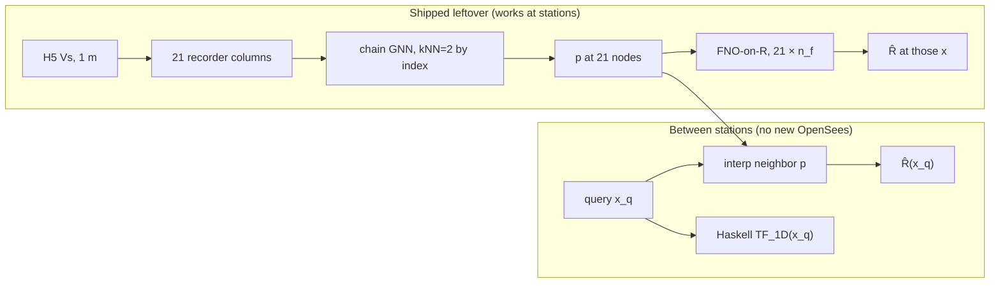

# Spatial query vs Graph NO

**Keep the ship.** Nested 21-station leftover that works is the chain GNN + FNO-on-\(R\), not the kernel query GNO. Between recorders, the spatial method that does not need new OpenSees is interpolate neighboring ship \(p\) (plus Haskell at \(x_q\)).

Savio kernel arms (16 Sep 2026): `M7680_kernel_spatial_{all,even,interior}`. All three **KILL** the three-layer gate. Hold-out vs interpolate-\(p\) was not run; nested already fails, so `M7680_gino_rebal_ft.pt` stays.

## Two jobs, two answers

| Job | What “good” is | What is not |
|-----|----------------|-------------|
| **Leftover at the 21 OpenSees stations** | Shipped GINO: index-kNN=2 **chain GNN** on recorder columns + **FNO-on-\(R\)** on the fixed \((21,n_f)\) lattice | Calling that encoder a Graph Neural Operator |
| **Leftover at an \(x\) that is not a trained recorder** | **Interpolate-\(p\)**: linear interp of neighboring ship branch codes, trunk at \((f,x_q/\lambda)\), Haskell \(\mathrm{TF}_{1D}(x_q)\). Physics-only floor is \(\hat R=0\) | Kernel GNO until it beats interpolate-\(p\) **and** nested ship gates |
| **Graph Neural Operator** (Li kernel integral) | \(p(x_q)=\sum_{y\in\mathcal{N}(x_q)}\kappa(x_q,y)\,u(y)\) with neighbors in **physical** \(x\), query set ≠ support set | `--encoder gno` in this repo (fixed 21-node line graph) |

The trunk is already continuous in **frequency**. Space was never mesh-agnostic on the ship path: \(p\) lives on the 21 stations (15 m on the 500 m strip).

## Nested 21-station test (same M7680 mix / seed-42 splits)

Kernel `all` is the fair nested compare (even / interior are station-hold-out trains; their extra tests are still 21-station and also KILL).

| Domain | Ship \(R^2(R)\) | Kernel \(R^2(R)\) | Ship rel \(L_2\) TF | Kernel rel \(L_2\) TF | Ship Pearson \(\lvert\mathrm{TF}\rvert\) |
|--------|-----------------|-------------------|---------------------|-----------------------|------------------------------------------|
| IID | **0.605** | 0.405 | **0.353** | 0.433 | **0.926** |
| Dipping | **0.696** | 0.427 | **0.322** | 0.443 | **0.903** |
| Three-layer | **0.474** | 0.167 | **0.525** | 0.661 | **0.869** |

Three-layer kill is rel \(L_2\) TF \(> 0.533\). Ship is under (0.525). Kernel all / even / interior: 0.661 / 0.661 / 0.663.

Kernel even and interior peaked at epoch 8 and 4, then plateaued. Mixer keys `gno.mix.*` / `gno.layers.*` did not load from the ship GNN (shape-skip). FNO-on-\(R\) is off on the kernel path (`residual_fno=false`) because the leftover lattice is no longer a fixed 21-wide FFT.

## What to call things

| Name in code / slides | What it actually is |
|-----------------------|---------------------|
| Shipped “GNO” / GINO | DeepONet + **chain GNN** field mixer + **FNO** leftover mixer. Operator in frequency (and FNO on the recorder–freq grid). |
| `--encoder kernel` | Thin Li-style GNO: physical-distance kNN (\(k=2\)), softmax \(-\lvert\Delta x\rvert/\tau\), MLP on \([\mathrm{node},\Delta x,\lvert\Delta x\rvert]\), 100 H5 support columns (stride 5). Labels still 21 TFs. |
| Interpolate-\(p\) | Spatial query **method** that reuses the ship. Not a new encoder. |
| Haskell-only | Spatial query with \(\hat R=0\). Always defined at any \(x_q\). |

Do not interpolate the 21 OpenSees TFs onto a denser \(x\)-grid and call that ground truth.

## If a true GNO is still the goal

Keep the kernel mixer. Do not promote it until (1) nested IID / dipping / three-layer beat the ship numbers above and (2) odd- and edge-station Pearson beat interpolate-\(p\) (`scoring/eval_spatial_query.py`). A latent-grid FNO (`--latent-fno`) is the leftover operator that can sit on variable queries; it was not in these Savio arms.

JSON: `results/arch_train/M7680_gino_rebal_ft.json` (ship), `M7680_kernel_spatial_*.json` (Savio). Score script: `scoring/eval_spatial_query.py`.
